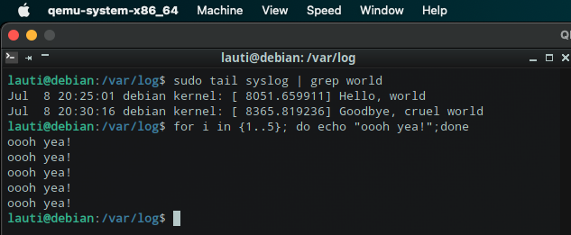

# Hello world in the kernel

We are following the Linux Device Drivers book to get a hint on how the kernel works.
This repo will document my journey on learning some cool kernel stuff.
Keep in mind I'm just hacking my way through this... things will be messy and suboptimal, I'm just making some experiments.

## Setting up an environment

Currently I'm using a mac that was provided by my employee. Which means, I need to do some black magic to being able to run, boot, develop and compile stuff for a linux kernel.
My choice was to install QEMU to create a virtual machine.
So basically what I did was:

```sh
## IN THE HOST ##

# install qemu
brew install qemu

# create a folder where my dev files will go
mkdir ~/lautaro/kerneldev

# create the necessary qcow for the Virtual Machine
qemu-img create -f qcow2 debian.qcow 40G

# emulate the x86_64 architecture of the OS I want to run
# provide some internet connection and some run
# boot the bunsenlabs image that I previously downloaded
# then install it
qemu-system-x86_64 -hda debian.qcow -cdrom bunsen.iso -net nic -net user -boot d -m 6000

# run my vm
# prepare everything to create a mount in the guest
# so I can share some files between host and guest
qemu-system-x86_64 \
    -hda debian.qcow \
    -net nic -net user -m 6000 \
    -virtfs local,path=/Users/ljayat/lautaro/kerneldev,mount_tag=host0,security_model=none,id=host0
```

Then I went to the guest and did the following

```sh
## IN THE GUEST ##

# created a folder where I wanted to have the mount
sudo mkdir /tmp/shared
# and mounted it
sudo mount -t 9p -o trans=virtio host0 /tmp/shared/
# Then I installed build-essential
sudo apt install build-essential
# and the linux headers for my kernel
sudo apt install linux-headers-$(uname -r)
# then I shared the libraries I knew would be useful
# to provide intelisense to my host IDE (bc I'm on mac)
cd /lib/modules/5.10.0-20-amd64/build
cp ./arch /tmp/shared/build/arch
cp ./include /tmp/shared/build/include
cd ../source
cp ./include /tmp/shared/source/include
cp ./arch /tmp/shared/source/arch
```

Because I'm going to develop in the host and then compile in the guest, I decided to create an alias for my bashrc in the guest.
This way I could develop in my guest's home directory, w/o touching anything in the shared folder.

```sh
## IN THE GUEST ##

# go back to the home
cd
mkdir kerneldev
echo "alias lown='sudo cp /tmp/shared/dev/* /home/lauti/kerneldev/. && cd /home/lauti/kerneldev/ && sudo chown lauti:lauti *" > .bashrc
source ~/.bashrc
```

## Performing the experiment

At the time I was writing this, both my makefile and my hello_kernel.c were in `~/lautaro/kerneldev/dev` so I just went to the guest and type the following:

```sh
## IN THE GUEST ##

cd ~/kerneldev
# my alias "lauti own", but it's more like "clown" now that I read it
lown
# build the thing
make
# mount the module
sudo insmod ./hello_kernel.ko
# remove the module
sudo rmmod hello_kernel
# check the kernel logs
# because I was in a terminal emulator
sudo tail /var/log/syslog | grep world
```

And I really liked what I saw:


